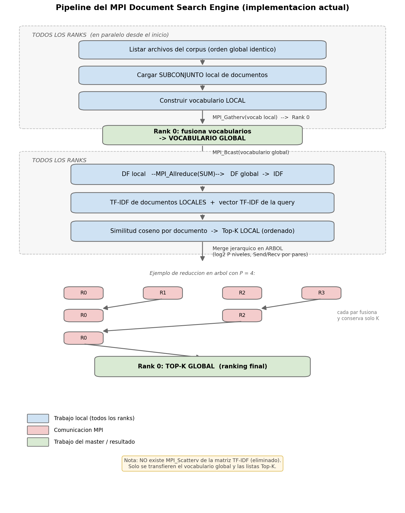

# MPI Document Search Engine

A parallel document search engine built with MPI that uses **TF-IDF** weighting and **cosine similarity** to find the most relevant documents for a given query. Designed to run on multi-node clusters (SC3 `legacy` partition).

## Architecture

La indexación es **distribuida**: cada rank carga un subconjunto del corpus,
construye un vocabulario local, el master fusiona y difunde el vocabulario
global, y luego todos calculan DF/IDF y TF-IDF en paralelo. **No** se distribuye
la matriz TF-IDF completa (no hay `MPI_Scatterv`): solo se transfieren el
vocabulario global y las listas Top-K, reduciendo el volumen de datos.



```
TODOS LOS RANKS (en paralelo desde el inicio)
  Listar archivos del corpus (orden global idéntico)
        │
  Cargar SUBCONJUNTO local de documentos
        │
  Construir vocabulario LOCAL
        │  MPI_Gatherv(vocab local) → Rank 0
        ▼
  Rank 0: fusiona vocabularios → VOCABULARIO GLOBAL
        │  MPI_Bcast(vocabulario global)
        ▼
TODOS LOS RANKS
  DF local ──MPI_Allreduce(SUM)──► DF global → IDF
  TF-IDF de documentos LOCALES + vector TF-IDF de la query
  Similitud coseno por documento → Top-K LOCAL (ordenado)
        │  Merge jerárquico en ÁRBOL (log₂P niveles, Send/Recv por pares)
        ▼
  Rank 0: TOP-K GLOBAL (ranking final)
```

> El diagrama PNG se regenera con `python3 plot_pipeline.py`.

## Files

| File | Description |
|------|-------------|
| `search_engine.c` | Main MPI search engine (entry point) |
| `tfidf.c` / `tfidf.h` | TF-IDF utilities: tokenization, vocabulary, cosine similarity |
| `generate_corpus.py` | Generates synthetic text corpora for benchmarking |
| `generate_tables.py` | Parses raw CSV results and generates performance tables |
| `run_search.sh` | SLURM batch script for SC3 cluster |

## Building

### Local (with MPI installed)

```bash
mpicc -O2 -o search_engine search_engine.c tfidf.c -lm
```

### SC3 Cluster

```bash
module purge
module --ignore_cache load "mpi/openmpi-gcc11/4.1.6"
mpicc -O2 -o search_engine search_engine.c tfidf.c -lm
```

## Usage

### 1. Generate a Test Corpus

```bash
# Generate 1000 documents with 5000-word vocabulary
python3 generate_corpus.py --num-docs 1000 --vocab-size 5000 --output-dir corpus
```

### 2. Run the Search Engine

```bash
# Interactive mode (human-readable output)
mpirun -np 4 ./search_engine corpus "search query terms" 10

# CSV mode (for benchmarking)
mpirun -np 4 ./search_engine corpus "search query terms" 10 --csv
```

### 3. Run on SC3 Cluster

```bash
sbatch run_search.sh
```

This will:
1. Compile the search engine
2. Generate corpora at sizes: 100, 500, 1000, 5000 documents
3. Run experiments with 1, 2, 4, 8, 16, 32, 64 processes
4. Generate performance analysis tables in `results/`

### 4. Generate Performance Tables (manually)

```bash
python3 generate_tables.py --input results/raw_results.csv --output-dir results
```

## Output Format

### Interactive Mode

```
=== MPI Document Search Engine ===
Corpus: corpus (1000 documents)
Query:  "example search query"
Top-K:  10
Ranks:  4

Vocabulary size: 4532 words

--- Top 10 Results ---
Rank    Score       Doc ID
------  ----------  ------
1       0.847523    42
2       0.791034    187
...

--- Timing ---
Index build:  0.2341 s
Data scatter: 0.0023 s
Local search: 0.0512 s
Gather/merge: 0.0008 s
Total:        0.2884 s
```

### CSV Mode

```
procs,num_docs,vocab_size,top_k,index_time,scatter_time,search_time,merge_time,total_time
4,1000,4532,10,0.234100,0.002300,0.051200,0.000800,0.288400
```

## Algorithm Details

### TF-IDF (Term Frequency — Inverse Document Frequency)

- **TF(t,d)** = (count of term t in document d) / (total terms in d)
- **IDF(t)** = log(N / (1 + df(t))), where df(t) = number of documents containing t
- **TF-IDF(t,d)** = TF(t,d) × IDF(t)

### Cosine Similarity

```
sim(q, d) = (q · d) / (||q|| × ||d||)
```

Documents are ranked by their cosine similarity to the query vector.

### MPI Distribution Strategy

- Documents are evenly partitioned across P ranks; **each rank loads only its
  own subset** from disk (no central scatter of the TF-IDF matrix).
- Local vocabularies are gathered (`MPI_Gatherv`), merged on rank 0, and the
  global vocabulary is broadcast (`MPI_Bcast`).
- Document frequencies are reduced globally with `MPI_Allreduce` so every rank
  computes the same IDF, then its local TF-IDF matrix.
- Each rank computes cosine similarity for its chunk and keeps a local top-K.
- Local top-K lists are merged into a global top-K via a **hierarchical tree
  reduction** (`MPI_Send`/`MPI_Recv` over log₂P levels), not a flat gather.
